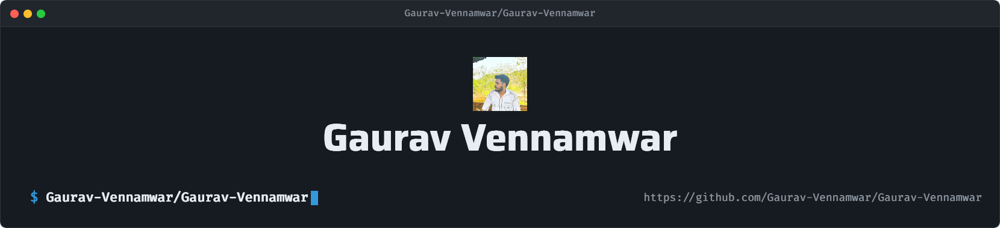

<!--
  Profile README for Gaurav-Vennamwar
  Replace the four YOUR_* values in the contact section before publishing.
-->

<div align="center">

  <picture>
  <source media="(prefers-color-scheme: dark)" srcset="art/header-dark.png">
  <source media="(prefers-color-scheme: light)" srcset="art/header-light.png">
  
</picture>

  <br />

  <a href="https://readme-typing-svg.demolab.com?font=Fira+Code&weight=600&size=22&duration=3500&pause=1200&color=EF93C4&center=true&vCenter=true&width=620&lines=ASP.NET+Core+%C3%97+Angular;Clean+architecture%2C+secure+APIs%2C+real+products;Currently+shipping+SKMS+%F0%9F%9A%80">
    
  </a>

  <br />
  <br />

  <a href="https://github.com/Gaurav-Vennamwar?tab=followers"></a>
  <a href="https://github.com/Gaurav-Vennamwar?tab=repositories"></a>
  

</div>

## About

```text
Mumbai, India  •  Engineering graduate, AI/ML  •  Open to full-stack & backend roles
```

I’m a developer who enjoys the seam between a thoughtful API and a polished interface. I build with **ASP.NET Core** and **Angular**, with a particular interest in authentication, maintainable architecture, and products that earn users’ trust.

Right now, I’m building **SKMS** — a secure, enterprise-minded knowledge platform designed around clean boundaries, reliable identity flows, and a practical writing experience.

<details>
<summary><b>What I care about</b></summary>
<br />

- **Security that feels invisible:** JWT authentication, refresh-token rotation, authorization, and safe API design.
- **Code that stays understandable:** clear domain boundaries, clean architecture, and deliberate conventions.
- **Learning by shipping:** EF Core, Angular signals, and modern patterns through real product work.
</details>

## 🚀 Featured Projects

### 🧠 Secure Knowledge Management System (LIVE)


<table>
<tr>
<td width="33%" align="center">

### 🔐 Identity First

JWT authentication, refresh-token rotation, and role-based authorization built for secure access.

</td>

<td width="33%" align="center">

### 🏗️ Built to Scale

Clean architecture, Entity Framework Core, and maintainable APIs designed for long-term growth.

</td>

<td width="33%" align="center">

### ✍️ Knowledge Platform

Production-ready knowledge management system with Markdown editor, syntax highlighting, and Cloudinary integration.

</td>
</tr>
</table>

<br/>

### 🤖 Ascendly AI (In Development)

<table>
<tr>
<td width="33%" align="center">

### 📄 Resume Intelligence

AI-powered resume analysis with ATS optimization to improve interview readiness.

</td>

<td width="33%" align="center">

### 🎯 Interview Preparation

Mock interviews, personalized learning roadmaps, and AI-powered career guidance.

</td>

<td width="33%" align="center">

### 🚀 Next-Gen Career Platform

Modern SaaS application built with Angular, ASP.NET Core, Azure SQL, AI integration, Render and Vercel.

</td>
</tr>
</table>

<div align="center">
  <i>Turning “it works” into “it will keep working.”</i>
</div>

## Toolkit

<div align="center">
  
</div>

<br />

<div align="center">

| Backend | Frontend | Practices & tooling |
| :---: | :---: | :---: |
| C# · .NET 8 · ASP.NET Core · EF Core | Angular · TypeScript · Signals | REST APIs · JWT · Azure · Git |

</div>

## GitHub by the numbers

<div align="center">

  
  

  <br />
  <br />

  

</div>

<div align="center">
  
</div>

## Contribution trail

<div align="center">
  
  <br />
  <sub>Updated daily with <a href="https://github.com/Platane/snk">Platane/snk</a>.</sub>
</div>

## Let’s connect

<div align="center">
<a href="[https://linkedin.com/in/YOUR_LINKEDIN](https://www.linkedin.com/in/gaurav-vennamwar-0b79b0212/)"></a>
<a href="https://x.com/YOUR_X_HANDLE"></a>
<a href="https://www.instagram.com/_.gauuravvv._/"></a>
<a href="mailto:vennamwarg@gmail.com"></a>
 
</div>
  <br />
  <br />

  <sub>Have an interesting backend, full-stack, or product problem? I’d love to hear about it.</sub>


<br />


